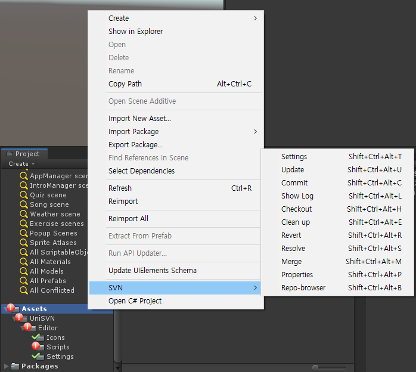
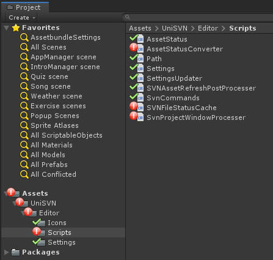

# Introduction
  As you know, a meta file should be a set of asset file in Unity. If you upload an asset file without a meta file, an asset file’s GUID will be generated differently per each user’s computer. And then, every object that linked that asset will be missed.
  
  But if you working with other team members who don’t familiar with this process like design or art team, it’s so hard to manage or educate them to not mistake this kind of matters(This is also what I experience with it!)
  
  To prevent this matter, I made UniSVN to do almost everything about SVN’s functions inside Unity!

# Features

#2 SVN Commands

If you excute svn commands like update, commit using UniSVN's menu, the meta file will be added AUTOMATICALLY!

Settings	[Shift+Ctrl+Alt+T]
Update		[Shift+Ctrl+Alt+U]
Commit	[Shift+Ctrl+Alt+C]
Show Log	[Shift+Ctrl+Alt+L]
Checkout	[Shift+Ctrl+Alt+H]
Clean up	[Shift+Ctrl+Alt+E]
Revert		[Shift+Ctrl+Alt+R]
Resolve	[Shift+Ctrl+Alt+S]
Merge		[Shift+Ctrl+Alt+M]
Properties	[Shift+Ctrl+Alt+P]
Repo-brower	[Shift+Ctrl+Alt+B]

#2 Asset Status

Now you can keep watching how synchronized assets' status inside Unity's project view.

Here is an explanation of icons below.

- The asset is synchronized with the repository.

- You made the asset.
- Or You FORGOT to commit meta file!

- The asset or meta file is modified.

- The asset is conflicted. It happens sometimes when you updated without committed the asset.

- You linked external with the asset.

- You added the asset manually.

# References
* https://github.com/wlgys8/UnitySVN

